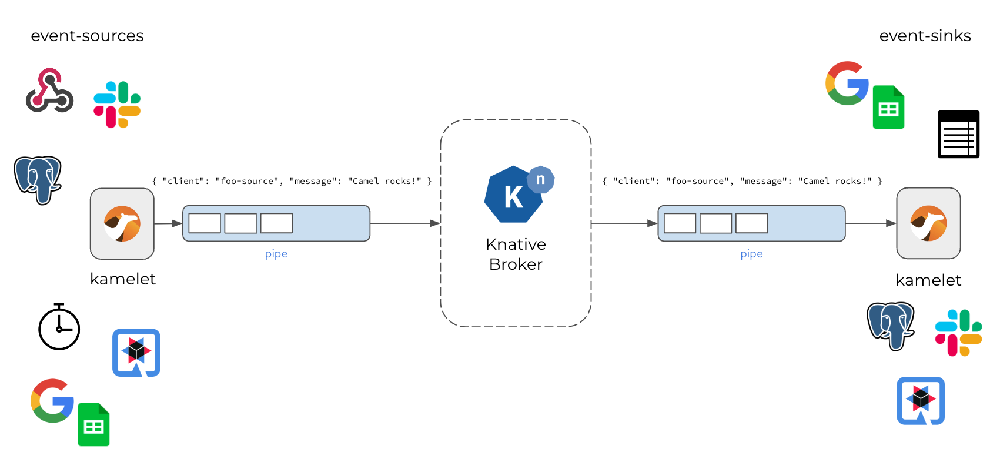

# Kamelets Knative Demo

This project shows how to use Camel K and Kamelets as event sources and sinks for Knative eventing. 
The Kamelets are used in Pipes and Camel K integrations to connect the Knative message broker to the world.

## Objectives

The project uses several Pipe custom resources that will act as event sources and sinks.
See the code in [pipes](camel-k/pipes) and [routes](camel-k/routes) for details. 

You will learn how to apply the Pipes to the Kubernetes cluster so that the Camel K operator builds and runs the integrations.
Each Pipe either produces or consumes a Knative event of type `org.apache.camel.event.messages`.

Each message event is a simple Json object that looks like this:

```json
{ "client": "camel-test", "message": "Apache Camel rocks!" }
```

The demo produces these events as event sources to the Knative message broker and at the same time Pipes consume the events from the Knative broker in order to push the data to several 3rd party services (e.g. Google Sheets, Slack, ...).



## Setup

You need a Kubernetes or OpenShift cluster with following software installed:

- Knative serving and eventing [Install Knative](https://knative.dev/docs/install/)
- Camel K operator [Install Camel K](https://camel.apache.org/camel-k/2.1.x/installation/installation.html)
- YAKS CLI and operator (optional for local and E2E testing) [YAKS operator](https://operatorhub.io/operator/yaks)
- Camel JBang (optional for local testing) [Install Camel JBang](https://camel.apache.org/manual/camel-jbang.html)

### Patches

In order to use a more recent Apache Camel 4.2 runtime (with Camel Quarkus 3.6.0) please apply the following patches in the operator namespace after installation.

```shell
k patch itp camel-k --type=merge -p '{"spec":{"build":{"runtimeVersion":"3.6.0"}}}'
k patch itp camel-k --type=merge -p '{"spec":{"build":{"maven":{"properties":{"quarkus.camel.service.discovery.include-patterns": "META-INF/services/org/apache/camel/transformer/*"}}}}}'
```

Please, also update the Kamelets to the same Apache Camel version 4.2:

```shell
curl -s https://raw.githubusercontent.com/apache/camel-kamelets/v4.2.0/kamelets/aws-s3-source.kamelet.yaml | kubectl apply -f -
curl -s https://raw.githubusercontent.com/apache/camel-kamelets/v4.2.0/kamelets/google-sheets-sink.kamelet.yaml | kubectl apply -f -
curl -s https://raw.githubusercontent.com/apache/camel-kamelets/v4.2.0/kamelets/insert-field-action.kamelet.yaml | kubectl apply -f -
curl -s https://raw.githubusercontent.com/apache/camel-kamelets/v4.2.0/kamelets/set-body-action.kamelet.yaml | kubectl apply -f -
curl -s https://raw.githubusercontent.com/apache/camel-kamelets/v4.2.0/kamelets/data-type-action.kamelet.yaml | kubectl apply -f -
```

### Knative broker

First create a new demo namespace (e.g. `camel-demo`) and create a Knative broker:

```shell
k apply -f infra/knative-broker.yaml
```

### Secrets and ConfigMaps

The Camel K integrations connect to different 3rd party services that require credentials and authentication tokens.
Please visit the individual `application.properties` and fill in your user credentials and connection parameters.

- Google Sheets: [camel-k/pipes/google-sheets/application.properties](camel-k/pipes/google-sheets/application.properties)
- Slack: [camel-k/pipes/slack/application.properties](camel-k/pipes/slack/application.properties)
- AWS S3: [camel-k/pipes/aws-s3/application.properties](camel-k/pipes/aws-s3/application.properties)

Then create the secrets in your demo namespace as follows:

```shell
k create secret generic google-sheets-credentials --from-file=camel-k/pipes/google-sheets/application.properties
k create secret generic slack-credentials --from-file=camel-k/pipes/slack/application.properties
k create secret generic aws-s3-credentials --from-file=camel-k/pipes/aws-s3/application.properties
```

## Using LibreTranslate

Some example Pipes use a translation service called [LibreTranslate](https://libretranslate.com/). 

You should deploy a local instance of this translation service in your demo namespace:

Please make sure to adjust the ConfigMap in [infra/libre-translate.yaml](infra/libre-translate.yaml) that points to the translation service (`translate.service.host=libre-translate.camel-demo.svc.cluster.local`) before applying the files (you may need to adjust the user namespace in the URL).

```shell
k apply -f infra/libre-translate.yaml
```

Also, please install a custom Kamelet that interacts with the translation service.

```shell
k apply -f camel-k/kamelets/libre-translate-action.kamelet.yaml
```

## Running the Pipes

The Pipe resources are located in [camel-k/pipes](camel-k/pipes).

You can just apply the Pipe custom resources to your demo namespace with:

```shell
k apply -f camel-k/pipes/timer/timer-source-pipe.yaml
```

You should be provided with Camel K integration and a deployment shortly after that command.

You can use the kamel CLI to list the pipe status and also review the logs.

```shell
kamel get
```

```shell
kamel logs timer-source-pipe
```

You should see the Pod log output and see the events being produced and consumed respectively.

## Testing

You can verify the Camel K pipes and routes with [Camel JBang](https://camel.apache.org/manual/camel-jbang.html) and [YAKS](https://github.com/citrusframework/yaks).

You need to install YAKS and Camel JBang command line interfaces to run the tests.
The tests are written as Cucumber Gherkin `.feature` files (e.g. [timer-source-pipe.feature](camel-k/pipes/timer/timer-source-pipe.feature)).

The test will run the Pipe locally with Camel JBang and verify its behavior with simulating the Knative message broker.

```shell
yaks run camel-k/pipes/timer/timer-source-pipe.feature --local
```

This will start the test that automatically provisions the required test infrastructure and the Camel K Pipe under test.

Once you are happy with the Pipe you can also run the same test in the connected Kubernetes environment.
Just skip the `--local` option to run the test as a custom resource in Kubernetes.

You need to have the YAKS operator installed on the cluster.
The operator will take care on preparing the test runtime as a Job/Pod.

```shell
yaks run camel-k/pipes/timer/timer-source-pipe.feature
```

Now you should see a test Job being created in the namespace and the test runs in a Pod.
The test logs should be forwarded to your terminal output.

You can list the executed tests and its outcome also with the YAKS CLI.

```shell
yaks ls
```
